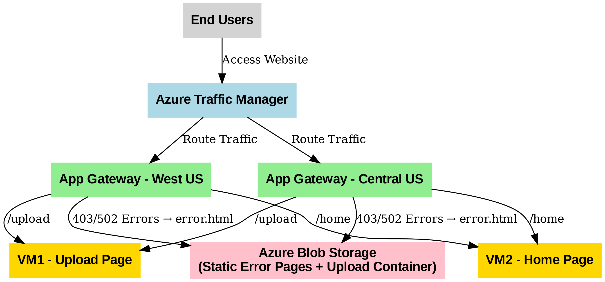

# 🚀 Azure Multi-Region Website Deployment with Traffic Manager & Application Gateway

## 📌 Project Overview
This project demonstrates how to deploy a **multi-region web application** on Azure using **Traffic Manager, Application Gateway, and Blob Storage**.  
The architecture ensures **high availability, fault tolerance, and optimal traffic distribution** between **Central US** and **West US** regions.  

---

## 🛠️ Tools & Technologies
- **Cloud Services:** Azure VMs, VNet, Application Gateway, Traffic Manager, Blob Storage  
- **Networking:** VNet Peering, Load Balancing  
- **Scripts:** Bash, Python   

---

## ⚙️ Architecture
  

---

## 🚀 Implementation Steps
1. **VM Setup**
   - Deployed **VM1** (Upload Page) and **VM2** (Home Page) in both **Central US** and **West US** regions.  
   - Cloned GitHub repo and ran setup scripts (`vm1.sh`, `vm2.sh`).  
   - Updated `config.py` on VM1 to connect uploads to Azure Blob Storage.  

2. **Application Gateway**
   - Configured routing rules:  
     - `example.com` → Home Page (VM2)  
     - `example.com/upload` → Upload Page (VM1)  
   - Configured **custom error handling** (403/502) → redirect to `error.html` hosted in Blob Storage.  

3. **Blob Storage**
   - Hosted `error.html` as a **static website** in Azure Storage.  
   - Created **upload container** for storing uploaded files.  

4. **Networking**
   - Configured **VNet-to-VNet Peering** between Central US and West US regions.  

5. **Traffic Manager**
   - Configured **Traffic Manager** to distribute traffic between both Application Gateways.  
   - Validated failover and load distribution.  

---

## ✅ Outcomes
- Built a **multi-region website deployment** on Azure.  
- Ensured **high availability** with Traffic Manager and Application Gateway.  
- Configured **Blob Storage** for file uploads and static error pages.  
- Improved performance and reliability across regions.
